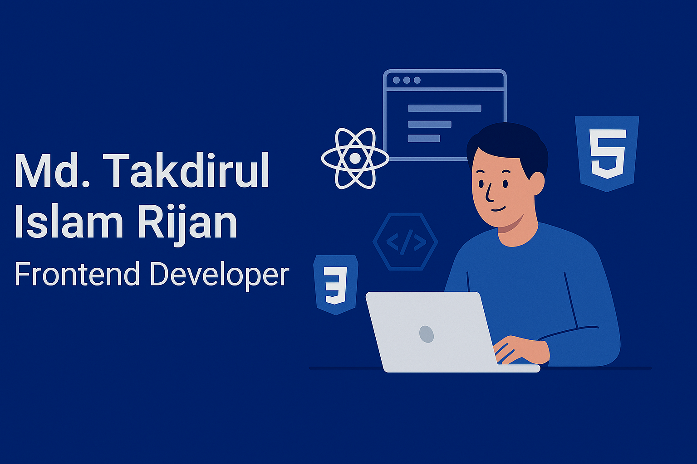

# Hi there, it's a pleasure to see you.
Welcome to my profile!
I'm Md. Takdirul Islam Rijan Frontend Developer from  Dhaka, Bangladesh.

## About Me
I am a dedicated frontend developer focused on building modern, responsive, and user-friendly web applications. I work mainly with JavaScript and React, and I’m currently strengthening my backend skills with Node.js, Express.js, and MongoDB to grow as a MERN developer.

---

## What I'm Working On

-  Building real-world MERN projects to strengthen full-stack skills  
-  Recently carried out a **Utility Bill Management System** with full backend + database integration  
-  Recently completed a **Kids Toy Store Platform** focusing on React authentication and protected routes  
-  Improving state management, routing, and component architecture through hands-on React projects  
-  Practicing advanced frontend UI/UX to build more polished interfaces  
-  Exploring **JWT Authentication**, secure login flows, and session management  
-  Learning Express.js and MongoDB to grow as a full MERN stack developer  
-  Using Firebase for auth, hosting, and real-time features in small-scale projects  

---

##  Skills & Technologies

### **Frontend**

  

### **Backend**

  

### **Tools**

  

---

## 🔗 Connect With Me
- **GitHub:** https://github.com/Takdirul-Rijan  
- **Email:** takdirul.rijan@gmail.com  
- **Location:** Dhaka, Bangladesh  

---

##  GitHub Stats

---

## 📌 Pinned Projects (Recommendations)
Make sure to pin **at least 3 repositories** with:

### ✔ Repository Description Format  
- Short project overview  
- Live site link  
- Technology stack  

### ✔ README Structure (For Each Project)
- Project overview  
- Screenshot  
- Main technologies  
- Main features  
- Dependencies list  
- Setup instructions (how to run locally)  
- Live demo link + GitHub repo link  

---

## ⭐ Final Notes
This README is ready to use.  
Just upload your banner (e.g., `your-banner.png`) and update the image path.

If you want, I can also **design a custom banner** for your GitHub profile.
